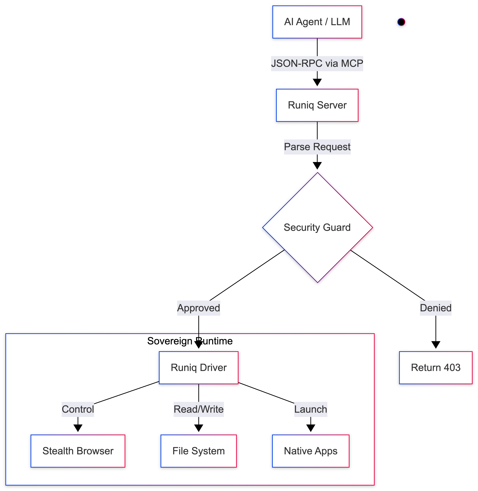

# ⚡ Runiq
> **The Sovereign Runtime for Autonomous AI Agents.**

[](https://opensource.org/licenses/MIT)
[](https://golang.org/dl/)
[](https://modelcontextprotocol.io)
[](https://github.com/qaysSE/runiq)

**Runiq** is the local infrastructure layer that gives AI models (Claude, GPT-4, Llama) direct, permissioned control over your computer. It turns conversational chatbots into capable coworkers that can browse the web, manage files, and control applications—all under your supervision.

---

## 🚀 The Philosophy
Runiq acts as the **Hands** for your AI's **Brain**.

While other tools build chat interfaces for *humans*, Runiq builds standardized tooling for *agents*. It allows an LLM to "wake up" on your machine and say: *"I need to research this competitor,"* and then actually go do it—navigating, clicking, and saving files autonomously.

* **🤖 Agent-First:** Exposes capabilities as structured [MCP](https://modelcontextprotocol.io) tools, not human commands.
* **🛡️ Sovereign by Default:** Runs 100% on your metal. Your cookies, credentials, and data never leave your local network.
* **🔧 Modular Runtime:** A developer SDK (`engine`, `driver`, `server`) designed for extension.

---

## ✨ Features

| Feature | What it Does | Why it Matters |
| :--- | :--- | :--- |
| **🌐 Stealth Browser** | A hardened Chromium engine with anti-detect patching. | Agents can scrape complex sites (LinkedIn, Glassdoor) without getting blocked. **Auto-shuts down after tasks.** |
| **📁 Native Filesystem** | Secure read/write access to your local disk. | Agents can save reports, organize downloads, and manage codebases directly. |
| **🛡️ Security Guard** | A native popup system for dangerous actions. | **You stay in control.** The agent must ask permission before writing files or executing commands. |
| **🔌 Universal MCP** | Native support for the Model Context Protocol. | Plug-and-play with **Claude Desktop**, **LangChain**, and **OpenAI Assistants**. |

---

## 💻 Compatibility

| OS | Status | Notes |
| :--- | :--- | :--- |
| **macOS** | ✅ Stable | Uses native AppleScript for Security Popups & Notifications. |
| **Windows** | ⚠️ Beta | Uses VBScript for Security Popups. PowerShell 5.0+ required. |
| **Linux** | ⚠️ Headless | Optimized for server/background use. Auto-allows actions (check logs). |

---

## 🏗️ Architecture

Runiq sits between the Intelligence Layer (AI) and the OS Layer (Your Computer).



---

## 📦 Quick Start

### 1. Installation (Build from Source)
Runiq is a single Go binary. You can compile it for any platform.

```bash
# Clone the repository
git clone [https://github.com/qaysSE/runiq.git](https://github.com/qaysSE/runiq.git)
cd runiq

# Build and Install
# (This script compiles and moves the binary to /usr/local/bin)
bash build_runiq.sh

2. Connect to Claude Desktop
Runiq integrates natively with the Claude Desktop App via MCP.

Edit Config File:

Mac: ~/Library/Application Support/Claude/claude_desktop_config.json

Windows: %APPDATA%\Claude\claude_desktop_config.json

Add this JSON:

JSON

{
  "mcpServers": {
    "runiq": {
      "command": "/usr/local/bin/runiq",
      "args": []
    }
  }
}
3. Usage
Restart Claude and look for the 🔌 icon. You now have tools like:

runiq_navigate(url)

runiq_click(selector)

runiq_write_file(path, content)

Try this prompt:

"Create a folder on my Desktop called 'Market_Research'. Then, navigate to news.ycombinator.com, take a screenshot of the top posts, and save it into that folder."

🛠️ For Developers (Python / Custom Agents)
Runiq communicates via Standard Input/Output (Stdio) using the Model Context Protocol (MCP). You can connect it to any language (Python, Node, Rust) without special libraries.

Python Integration
Since Runiq runs locally, your Python script spawns it as a subprocess and sends JSON-RPC messages to its stdin.

👉 See the full working example here

Basic Pattern:

Python

import subprocess, json

# Start Runiq
process = subprocess.Popen(
    ["/usr/local/bin/runiq"],
    stdin=subprocess.PIPE,
    stdout=subprocess.PIPE,
    text=True
)

# Send a Command (e.g., Navigate)
payload = {
    "jsonrpc": "2.0", 
    "id": 1, 
    "method": "tools/call", 
    "params": {"name": "runiq_navigate", "arguments": {"url": "[https://github.com](https://github.com)"}}
}
process.stdin.write(json.dumps(payload) + "\n")
process.stdin.flush()

# Read Response
response = json.loads(process.stdout.readline())
💡 Agent Prompting Tips
To prevent crashes and ensure reliability, add these rules to your System Prompt:

Handling Screenshots:

❌ Don't: Ask the agent to "read" the screenshot file. (Binary data breaks JSON).

✅ Do: Instruct the agent to save the screenshot to a specific path using the path argument.

Prompt: "When taking screenshots, always provide the 'path' argument (e.g., /Desktop/image.png)."

Navigation & Timing:

Modern websites (SPA) need time to "hydrate" after navigation.

Prompt: "After navigating to a URL, assume the page needs a moment to load before clicking."

Code Tip: Add time.sleep(2) in your tool wrapper after runiq_navigate returns.

Precise Clicking:

LLMs are better at CSS selectors than vague descriptions.

Prompt: "Use specific CSS selectors for clicking (e.g., 'article h2 a' instead of 'the first link')."

📜 License
MIT License. Built for the Sovereign AI future.
